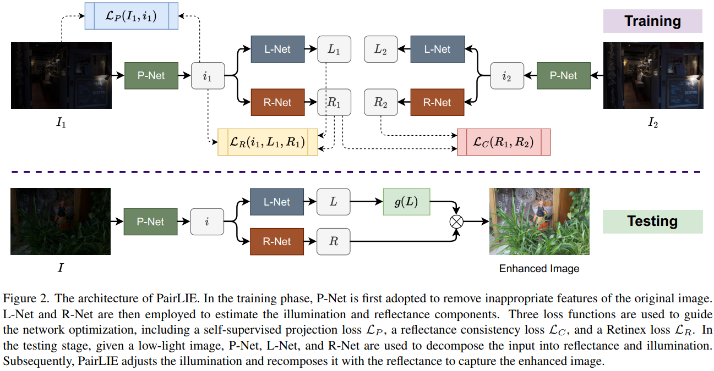

# Learning a Simple Low-light Image Enhancer from Paired Low-light Instances (CVPR 2023)([Paper]())
The Pytorch Implementation of PairLIE. 

<div align=center></div>

## Introduction
In this project, we use Ubuntu 16.04.5, Python 3.7, Pytorch 1.12.0 and one NVIDIA RTX 2080Ti GPU. 

## Datasets and results
Training dataset, testing dataset, and our predictions are available at [Google Drive](https://drive.google.com/file/d/1gM3QeNDOCzx0m1gpOoQD1TnGv1BELy08/view?usp=sharing).

### Testing

The pretrained model is in the ./weights.

Check the model and image pathes in eval.py, and then run:

```
python eval.py
```

### Training

To train the model, you need to prepare our training dataset.

Check the dataset path in main.py, and then run:
```
python main.py
```

## Citation

If you find PairLIE is useful in your research, please cite our paper:

```

```
